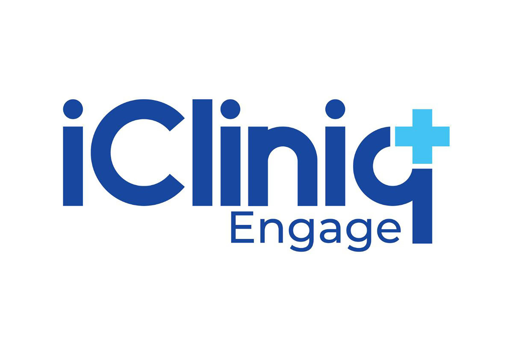

# iCliniq Documentation

## Overview

This repository contains proprietary documentation from my time working with **iCliniq**, a health-tech startup headquartered in the US. iCliniq initially focused on being a second opinion/telemedicine platform but soon recognized the potential to evolve into a **Health Decisions Platform**, marking the point at which I joined the company. 

<!-- Resize image to 75% -->

During my time with iCliniq, I contributed to key projects, particularly around **Machine Learning** and **AI integration** into existing workflows. This document highlights research, implementation strategies, and the technical specifics behind the **AI systems** I helped build, including the **ICD-11 Classifier**, **Specialty Classifier**, and **Smart Doctor**, among others.

## Why This Documentation is Here

I am sharing this documentation as part of my professional portfolio to demonstrate the critical role I played in the development of AI-powered healthcare services at iCliniq. These projects pushed the boundaries of AI applications in healthcare, shaping my expertise in the intersection of healthcare technology. While this content is proprietary, it provides an essential snapshot of my ability to drive machine learning initiatives that blend technology with real-world healthcare challenges.

This document should not be distributed beyond the intended audience, as it contains sensitive information related to proprietary workflows, algorithms, and business operations that were crucial to the success of iCliniq's telemedicine platform.

## Contents

- **Smart Doctor**: An AI tool to assist doctors in answering patient queries .
- **Specialty Classifier**: Classifying patient queries and connecting them to the most appropriate medical specialist.
- **Resolving Doctor Address Errors**: Implementing solutions to solve doctor address mismatch.
- **ICD-11 Classifier**: Automating the classification of diseases using the latest ICD-11 API.
- **Healthquill**: Program to understand contents of PDF reports.

## Disclaimer

Please note that the contents of this document remain the intellectual property of iCliniq and are shared here strictly for professional review purposes. Unauthorized distribution or use of the material without permission from iCliniq is prohibited.
